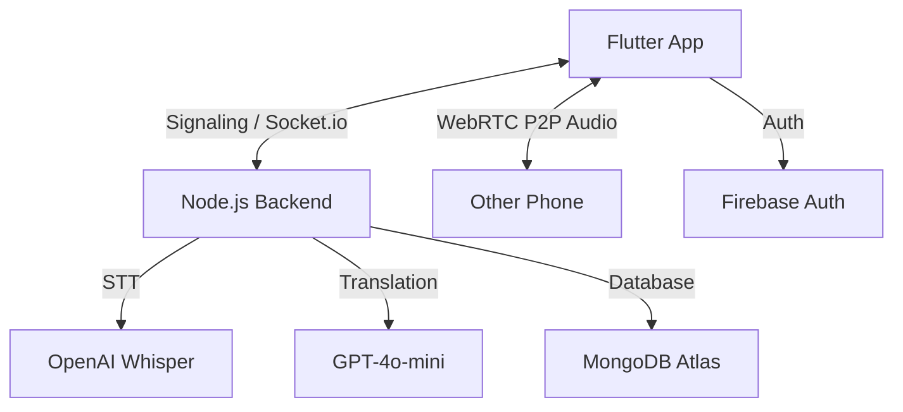

# AI Voice Translator 🎙️🌐

A professional-grade, real-time live calling and voice translation application. Features include P2P WebRTC calls, automated background translation, and cloud sync with MongoDB Atlas.

## 🏗️ Architecture


---

## 🛠️ Backend Setup (Node.js)

### 1. Environment Variables
Create a `.env` file in the `backend/` directory:
```env
PORT=3000
OPENAI_API_KEY=sk-proj-...
MONGODB_URI=mongodb+srv://<user>:<pass>@cluster0.mongodb.net/ai_translator
TTS_VOICE=nova
```

### 2. Run Locally
```bash
cd backend
npm install
npm run dev
```

---

## 📱 Frontend Setup (Flutter)

### 1. Firebase Configuration
*   Create a project on [Firebase Console](https://console.firebase.google.com/).
*   Enable **Email/Password** authentication.
*   Add your Android/iOS app and download `google-services.json` / `GoogleService-Info.plist`.
*   Place them in `android/app/` and `ios/Runner/`.

### 2. Android Permissions
The following are already configured in `AndroidManifest.xml`:
*   `RECORD_AUDIO`: For capturing voice.
*   `INTERNET`: For backend communication.
*   `MODIFY_AUDIO_SETTINGS`: For speakerphone control.
*   `CAMERA`: (Optional for WebRTC video, currently audio only).

### 3. Run Commands
```bash
cd flutter_app
flutter pub get
flutter run
```

---

## ☁️ Deployment

### Backend (Render / Railway)
1.  Connect your GitHub repository.
2.  Set the **Root Directory** to `backend`.
3.  **Build Command**: `npm install`
4.  **Start Command**: `npm start`
5.  Add all `.env` variables to the Render/Railway dashboard Environment Settings.

### Frontend (Netlify / Vercel)
1.  Run `flutter build web --release`.
2.  Go to `build/web`.
3.  Ensure `_redirects` contains: `/* /index.html 200` (Done automatically by Antigravity).
4.  Upload the **contents** of `build/web` to Netlify.

---

## 📝 Configuration Checklist
- [ ] **MongoDB Atlas**: Ensure your IP is whitelisted in "Network Access".
- [ ] **OpenAI API**: Check your usage limits and ensure Whisper/GPT-4 models are available.
- [ ] **Backend URL**: In the app's **Settings**, update the URL to your live backend (e.g., `https://your-backend.onrender.com`).
- [ ] **STUN/TURN**: The app uses Google's free STUN servers. For high-traffic production, consider a TURN server (e.g., Twilio TURN).

---

## 🚀 Troubleshooting
*   **Code 14 (SQLite)**: Fixed. Ensure you are using the latest `HistoryService` which uses ApplicationDocumentsDirectory.
*   **WebRTC not connecting**: Ensure both devices are in the same room code and have microphone permissions granted.
